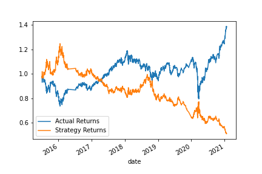

# Challenge_14

---

## *This is a helpfull program that will analzy the market of a stock to create Sell/Buy strategies with Machine Learning. Feel free to explore my codebase!* 

---

> Modules

## Data Files 

[Data files](Starter_Code/Resources/emerging_markets_ohlcv.csv)

## EVALUATION REPORT

### We analized the moving averages of a stock, using a short and small SMA rolling windows:
###    *Short Window SMA: 4 days
###    *Long Window SMA: 100 days

---

### After splitting the data and training it we used the SVC classifier model to fit the data and make predictions based on the testing data. 
### We created a cummulative return plot to show both the Actual Returns vs the Strategy Returns. 

### We can observe that the SVC strategy returns provides a better outcome than the actual returns. 

---

### We also tuned the baseline trading algorithm using Decision Tree Classifier to check for any improved predictions. This is the plot to show that strategy's returns vs the Actual Returns. 

### Unfortunately this strategy did not improve the retruns, in fact it performed very poorly. 