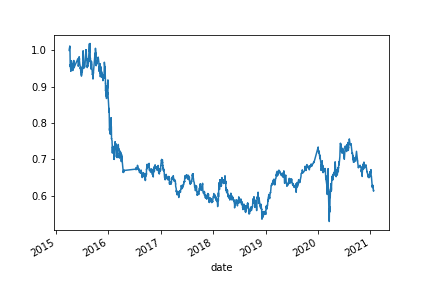

# Challenge_14

---

## *This is a helpfull program that will analzy the market of a stock to create Sell/Buy strategies with Machine Learning. Feel free to explore my codebase!* 

---

> Modules

## Data Files 

[Data files](Starter_Code/Resources/emerging_markets_ohlcv.csv)

## EVALUATION REPORT

# We analized the moving averages of a stock, using a short and small SMA rolling windows:
#    *Short Window SMA: 4 days
#    *Long Window SMA: 100 days

